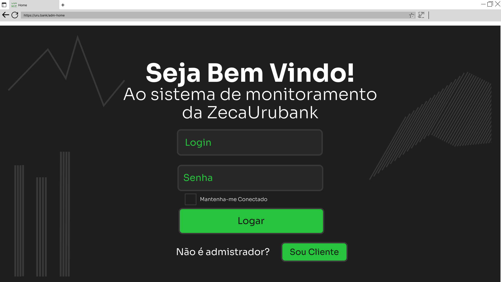
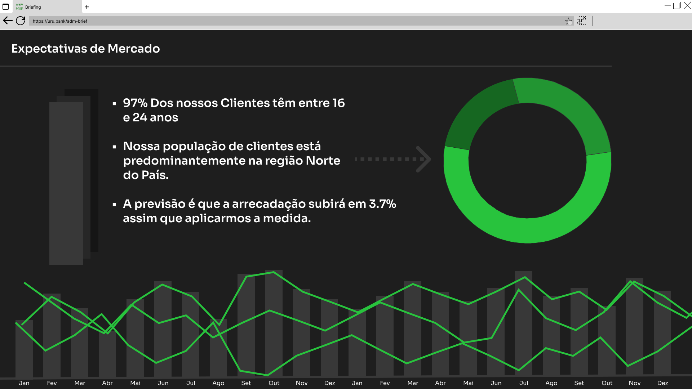

<h2 align="center"> Urubank ADM Pannel - ZecaAnálise.</h2>
<h1 align="center">

</h1>

## Overview
  Nosso sistema vem pra trazer métricas sólidas e transformá-las em gráficos intuitivos que facilitem o processo de análise. Com isso traremos mais eficiência e qualidade principalmente pro setor de marketing e planejamento que poderá tomar suas decisões mais tranquilo. Embora existam muitos sistemas que entreguem algo parecido (Como o Sentry por exemplo) o nosso sistema é dedicado e 100% personalizável. Conheça mais lendo logo abaixo 😉

## Escopo do Projeto 
O Sistema de Análises de Dados Bancários surgiu a partir da necessidade da startup bancária ZecaUrubank em realizar investimentos inteligentes na sua empresa a fim de evitar perdas financeiras significativas que possam prejudicar o seu desenvolvimento. 
Para melhor compreensão dessa exigência é essencial o entendimento da definição de uma startup. Esse termo tem origem inglesa e, traduzido de forma literal tem como significado: “empresa emergente”, por isso é utilizado para referir-se a empresas iniciantes que ainda estão na fase de definição de público-alvo e modelo de negócios. Dito isso, é compreensível que por ser uma entidade nova os seus recursos são limitados e, o seu alcance de público é baixo, por isso há essa necessidade de conhecer e compreender os usuários que estejam interessados em participar dessa empresa, no caso o Banco ZecaUrubank. 
A partir disso, houve a ideia de se criar um sistema capaz de captar esses dados, agrupando-os de acordo com os critérios exigidos possibilitando a criação de gráficos para uma análise detalhada dos usuários do banco. Para a realização deste projeto concluiu-se que ele deveria ser capaz de permitir uma interação de dados, por isso está sendo utilizado para o seu desenvolvimento o framework Node.JS, utilizando a linguagem JavaScript, HTML e CSS.

## Funcionalidades
As funcionalidades ou produtos gerados pelo nosso sistema de gerenciamento de dados, os quais são advindos da startup bancária ZecaUrubank, estão intrinsecamente relacionados aos processos de gestão de conhecimento. Tais processos são primordiais para a empresa obter um gerenciamento inteligente, evitando perdas e danos prejudiciais ao desenvolvimento dessa startup.
Por isso, antes de explicarmos quais serão as funcionalidades disponíveis em nosso sistema  devemos definir o que são esses processos, a sua importância para o desenvolvimento do projeto e como esses estão relacionados às funcionalidades do nosso projeto.
O que são Processos de Gestão de Conhecimento?

<h4 align="center"> Funcionalidades X Processos de gestão de conhecimento
<table align="center">
  <th> Funcionalidades </th>
  <th> Processo </th>
  <th> Descrição </th>
  <tr>
    <td> Obter dados do usuário a partir de seu login </td>
    <td> Adquirir conhecimento externamente </td>
    <td> Esse é o processo primordial para o funcionamento do nosso projeto, já que é a partir dele que o sistema obtém os dados necessários para análise, sendo eles: idade, localidade, sexo, renda média mensal, investimentos realizados </td>
  </tr>
  <tr>
    <td> Criação de gráficos de análise </td>
    <td> Processar e aplicar o conhecimento </td>
    <td> A partir da obtenção dos dados requeridos pelo sistema, é realizada um agrupamento desses, o que permite a criação de gráficos diversos para a compreensão detalhada sobre as características dos usuários </td>
  </tr>
  <tr>
    <td> Criação de gráficos de trajetória </td>
    <td> Reutilizar o conhecimento </td>
    <td> A partir das análises anteriores sobre as características dos usuários é possível realizar projeções ao usuário sobre a sua relação com o banco, o rendimento das suas aplicações </td>
  </tr>
</table>
  
## Conceitual
Página inicial para login do administrador do sistema

Página de métricas para análises

## Rotas
preencher

## Modelo e banco

## Sobre nós
preencher
  <!-- - [A ZecaUrubank©](https://github.com/ -->
  
##
Colaboradores:

#

	
    <a href="https://github.com/FreelyTian"> Samuel Araújo </a>  
		Bonjour Meu nome é Samuel Sou natural de Miracema do Tocantins, atualmente estagiário na Sefaz (Secretaria da Fazenda) e estudo Engenharia de software na Unicatólica Palmas. Nesse projeto atuo como
    <a href="https://www.atlassian.com/br/agile/scrum/scrum-master"> Scrum master. </a> e
    <a href="https://querobolsa.com.br/carreiras-e-profissoes/dba-administrador-de-banco-de-dados"> DBA. 
    </a> até o momento tem sido um projeto divertido - com seus desafios mas divertido - no qual pude ter muitas novas experiências bem úteis pra minha       carreira que ainda está no seu início mas é um bom início.

          

	
    <a href="https://github.com/kothz"> Esther Kothz Frank </a>  
		Meu nome é Esther Kohtz Frank, sou estudante de Engenharia de Software na Universidade Católica do Tocantins.
    Neste projeto atuo aplicando os processos de gestão de conhecimento as suas funcionalidades.

<!-- - [Esther Kohtz Frank](https://github.com/kothz)
- [Maria Clara Oliveira](https://github.com/clarasoliveira) -->
