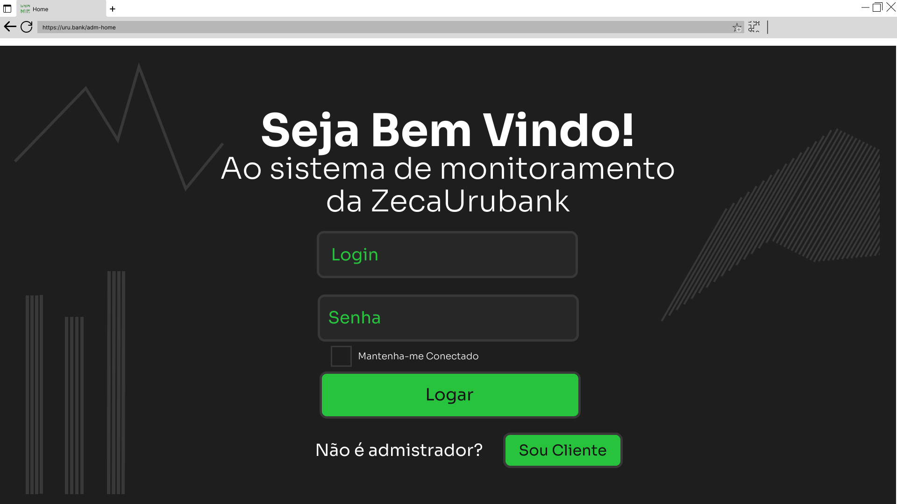
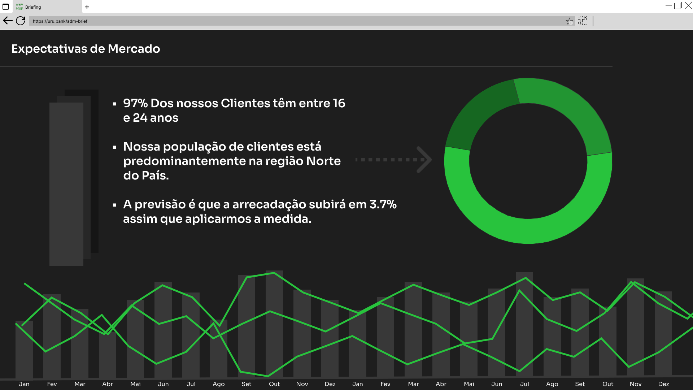

<h2 align="center"> Urubank ADM Pannel - ZecaAnálise.</h2>
<h1 align="center">

</h1>

## Overview
  Nosso sistema vem pra trazer métricas sólidas e transformá-las em gráficos intuitivos que facilitem o processo de análise. Com isso traremos mais eficiência e qualidade principalmente pro setor de marketing e planejamento que poderá tomar suas decisões mais tranquilo. Embora existam muitos sistemas que entreguem algo parecido (Como o Sentry por exemplo) o nosso sistema é dedicado e 100% personalizável. Conheça mais lendo logo abaixo 😉
  
## Funcionalidades
  - Gráfico de localidade da população de clientes
    - Com finalidade de apontar as melhores regiões pro setor de marketing
  - Gráfico de idade da população de clientes
    - Com finalidade de direcionar nossas investidas de acordo com a idade majoritária do público-alvo 
  - Gráfico de Rendimento mensal
    - Para como métrica auxiliar nas decisões de investimento do próprio banco
  
## Conceitual
Página inicial para login do administrador do sistema

Página de métricas para análises

## Configuração
preencher

## Rotas
preencher

## Sobre nós
preencher
  <!-- - [A ZecaUrubank©](https://github.com/ -->
  
##
Colaboradores:
[Samuel Araújo](https://github.com/FreelyTian)
